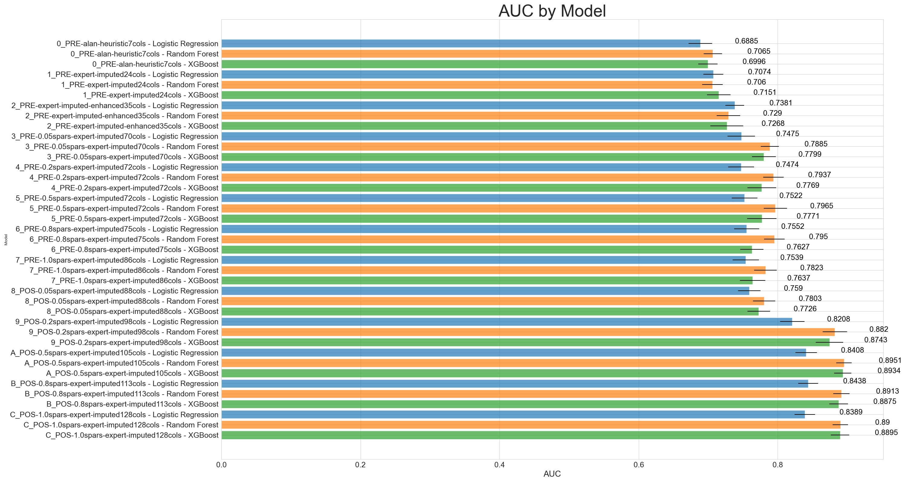
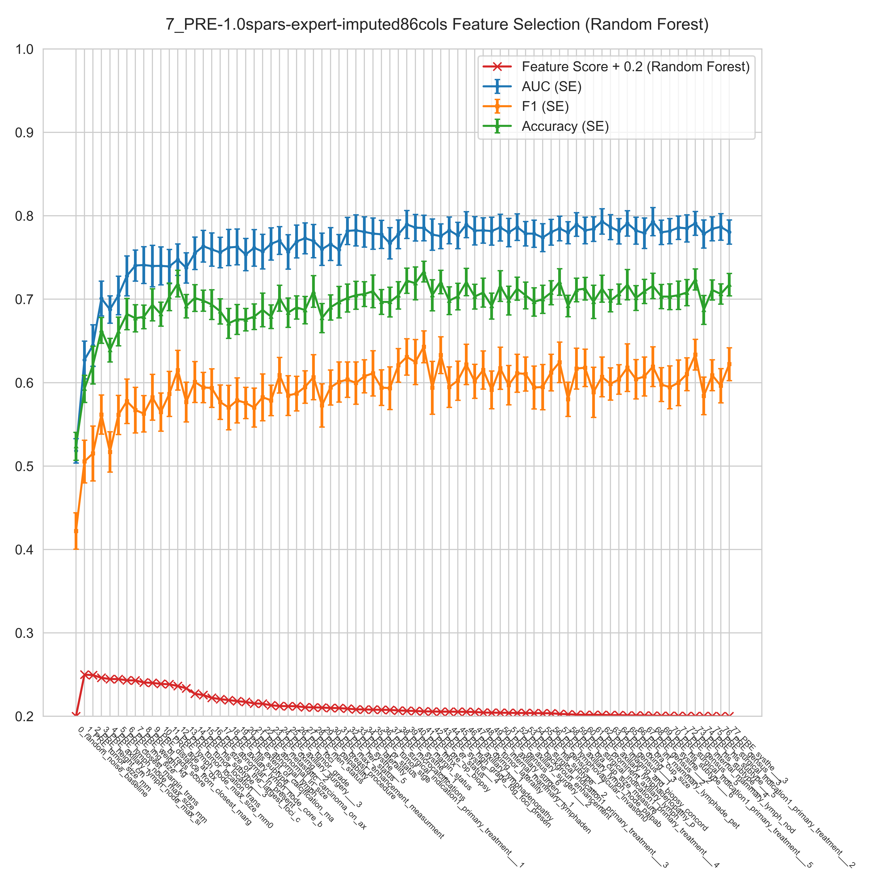

# Machine Learning for Radiotherapy Prediction
An end-to-end machine learning pipeline for predicting the need of post-mastectomy radiotherapy before breast cancer pathology diagnosis.

## Table of Contents
* [Introduction](#introduction)
* [Installation](#installation)
* [Usage](#usage)
* [Pipeline](#pipeline)
    * [Data Preprocessing Module](#data-preprocessing-module)
    * [ML Training-Evaluation Module](#ml-training-evaluation-module)
* [Results](#results)
    * [Figures](#figures)
        * [AUC Performance Metrics](#auc-performance-metrics)
        * [Feature Importance and Feature Selection](#feature-importance-and-feature-selection)
    * [Tables](#tables)
        * [Feature Scores by Model](#feature-scores-by-model)

## Introduction
Breast cancer patients experience higher quality of life if reconstruction of the breast tissue is done after the mastectomy. However, for patients requiring post-mastectomy radiotherapy, immediate breast reconstruction is not always the best option.
Since it is difficult to predict the need of post-mastectomy radiotherapy, we applied machine learning on a dataset containing 115 clinical features/variables. The features include the following: demographic, preoperative, intraoperative, and postoperative information. The target variable is the need of post-mastectomy radiotherapy.

## Installation
The necessary libraries could be installed with the following command:

`pip install -r requirements.txt` 

## Usage

To run the pipeline: `python3 main.py`

To run the pipeline in debug mode: `python3 main.py --debug`

To run the pipeline with previously-found best models: `python3 main.py -f `

To visualize data: `python3 src/visualize/visualizer.py`

To visualize all columns: `python3 src/visualize/visualizer.py -vizall`

To run tests: `python -m pytest tests/`

To display logs (with color-coded texts):
`cat data/preprocessed/<OUTPUT_TIMESTAMP>/log.txt`

To generate subsets of the original dataset using specific subsets of columns: `python scripts/generate_datasets.py`

To compare the two versions of the same dataset and obtain the differences: `python scripts/compare_datasets.py`

## Pipeline 
### Data Preprocessing Module
1. *Column Renaming*. Editing the column names of pre-operative, intra-operative, and post-operative features.
2. *Dataset Cleansing*. Systematically replacing noisy values using predetermined rules.
3. *Feature Engineering*. Construct new interaction features guided by clinical insights.
4. *Missing Value Imputation*. Fill in missing values using imputation strategies and machine learning. For each column:
    1. Determine the type of column as real, ordinal, or categorical
    2. Using 5-Fold Cross-Validation:
        * Apply K-Nearest Neighbor Imputer. Perform grid-search for optimal `K`.
        * Apply Random Forest Imputer. Perform grid-search for optimal `max_depth` and `n_trees`
        * Compare the KNN and RF imputers using accuracy, F1, and other metrics.
    5. Perform use multiple imputation using the more accurate imputation strategy
5. *Visualize Dataset*. Generate a figure highlighting the changed cell values in the dataset.
6. *Dataset Generation*. Generate subsets of the original dataset using specific subsets of columns.

### ML Training-Evaluation Module
1. *Dataset Loading*. Load the dataset from the preprocessed folder.
2. *Dataset Splitting*. Split the dataset into training and testing sets using stratified sampling of target variable.
3. *Model Training*. Train a model using the training set, and evaluate the model using the validation set. Uses K-Fold cross-validation.
4. *Model Evaluation*. Evaluate the model using AUC, F1, Accuracy, and other metrics.
5. *Metrics Visualization*. Generate a figure highlighting the performance of the models.
6. *Feature Importance*. Generate a feature importance plot for the model to determine which features are most important.
7. *Feature Selection*. Select features using a variety of methods, with the help of clinical insights.
8. *Model Selection*. Select the best model using a variety of methods, including using the visualizations generated in previous steps.
9. *Model Prediction*. Predict the probability of a patient requiring post-mastectomy radiotherapy using the best model.

## Results

### Figures

#### AUC Performance Metrics

#### Feature Importance and Feature Selection

### Tables

#### Feature Scores by Model
| Features                          | RF\_rank | LR\_rank | XGB\_rank | RF\_score | LR\_score | XGB\_score | Rank\_Product^(1/3) | Rank\_Product\_Rank |
| --------------------------------- | -------- | -------- | --------- | --------- | --------- | ---------- | ------------------- | ------------------- |
| PRE\_axillary\_lymphadenopathy    | 2        | 4        | 1         | 0.23      | 0.48      | 0.36       | 2                   | 1                   |
| PRE\_int\_mammary\_lymphade\_pet  | 4        | 1        | 2         | 0.18      | 1.07      | 0.22       | 2                   | 2                   |
| PRE\_abnormal\_lymph              | 1        | 3        | 4         | 0.24      | 0.58      | 0.14       | 2.29                | 3                   |
| PRE\_axillary\_lymphadenopathy\_p | 3        | 2        | 3         | 0.22      | 0.59      | 0.15       | 2.62                | 4                   |
| PRE\_prominent\_axillary\_lymph   | 5        | 6        | 5         | 0.09      | 0.08      | 0.07       | 5.31                | 5                   |
| PRE\_internal\_mammary\_lymphaden | 6        | 5        | 6         | 0.04      | 0.32      | 0.05       | 5.65                | 6                   |

