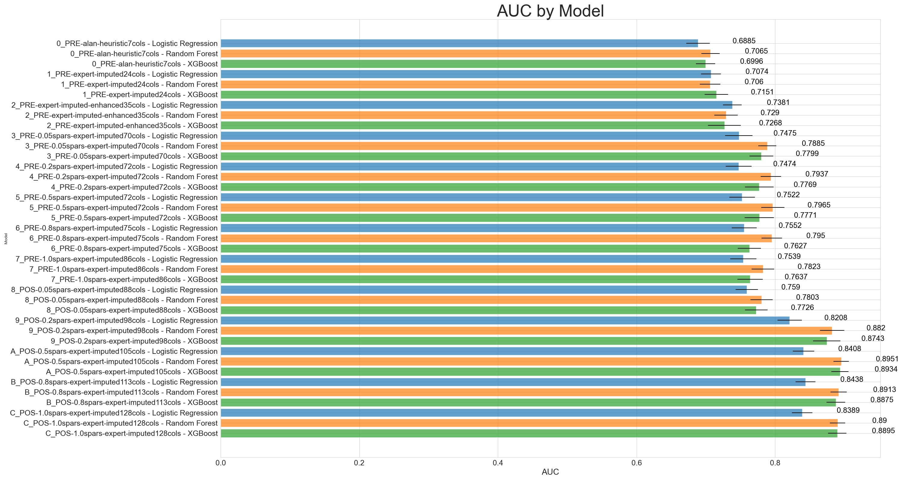

# Radiotherapy-Prediction
An end-to-end machine learning pipeline for predicting the need of post-mastectomy radiotherapy before breast cancer pathology diagnosis.

## Usage

To run the pipeline: `python3 main.py`

To run the pipeline in debug mode: `python3 main.py --debug`

To run the pipeline with previously-found best models: `python3 main.py -f `

To visualize data: `python3 src/visualize/visualizer.py`

To visualize all columns: `python3 src/visualize/visualizer.py -vizall`

To run tests: `python -m pytest tests/`

To display logs (with color-coded texts):
`cat data/preprocessed/<OUTPUT_TIMESTAMP>/log.txt`

To generate subsets of the original dataset using specific subsets of columns: `python scripts/generate_datasets.py`

To compare the two versions of the same dataset and obtain the differences: `python scripts/compare_datasets.py`

## Preprocessing Module
1. *Column Renaming*. Prefix "PRE_", "INT_", and "POS_" to indacate pre-operative, intra-operative, and post-operative columns.
2. *Dataset Cleansing*. Systematically replacing noisy values using predetermined rules.
3. *Feature Engineering*. Construct new interaction features guided by clinical insights.
4. *Missing Value Imputation*. Fill in missing values using imputation strategies and machine learning. For each column:
    1. Determine the type of column as real, ordinal, or categorical
    2. Apply K-Nearest Neighbor Imputer. Perform grid-search for optimal `K`.
    3. Apply Random Forest Imputer. Perform grid-search for optimal `max_depth` and `n_trees` using 5-fold cross-validation.
    4. Compare the KNN and RF imputers using accuracy, F1, and other metrics.
    5. ? use multiple imputation OR select the more accurate imputation strategy ?
5. *Visualize Dataset*. Generate a figure highlighting the changed cell values in the dataset.
6. *Dataset Generation*. Generate subsets of the original dataset using specific subsets of columns.

## Processing Module
1. *Dataset Loading*. Load the dataset from the preprocessed folder.
2. *Dataset Splitting*. Split the dataset into training and testing sets using stratified sampling of target variable.
3. *Model Training*. Train a model using the training set, and evaluate the model using the validation set. Uses K-Fold cross-validation.
4. *Model Evaluation*. Evaluate the model using AUC, F1, Accuracy, and other metrics.
5. *Metrics Visualization*. Generate a figure highlighting the performance of the models.
6. *Feature Importance*. Generate a feature importance plot for the model to determine which features are most important.
7. *Feature Selection*. Select features using a variety of methods, with the help of clinical insights.
8. *Model Selection*. Select the best model using a variety of methods, including using the visualizations generated in previous steps.
9. *Model Prediction*. Predict the probability of a patient requiring post-mastectomy radiotherapy using the best model.

## Results

### Figures

*Figure 1: AUC Performance Metrics*

/plots/7_PRE-1.0spars-expert-imputed86cols_top_features_metrics.png)
*Figure 2: Feature Selection Plot*